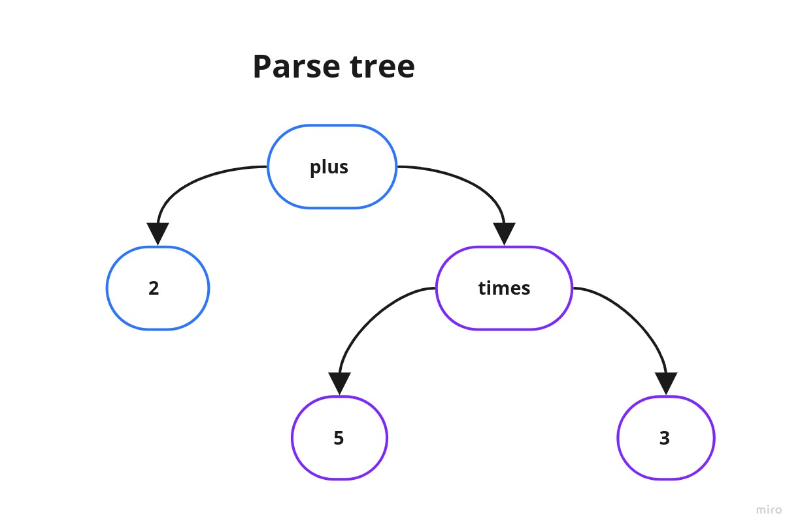

# Calculator
A calculator (console application) built with Node.js

## Description
This application allows the user to input verbal math expressions and gets the results using Syntax Tree.

**Available operators:**
- plus
- minus
- times
- divided

**Samples:**

|                     Input                   | Result |
|:-------------------------------------------:|:------:|
|               1 plus 3 minus 4              |   0    |
|               1 plus (3 times 4)            |   13   |
|               1 plus 1                      |   2    |
|               1000 minus 1                  |   999  |
|          2 plus 1 minus 5 divided 2 minus 1 |  -0.5  |
|               4 times 4                     |   16   |
|               20 divided 5                  |   4    |
|               0.5 times 10                  |   5    |

**Please, check the [Implementation](#implementation) section for more details.**

## Main technologies used

- [Node.js](https://nodejs.org/en): JavaScript runtime built on Chrome's V8 engine
- [TypeScript](https://www.typescriptlang.org): Typed JavaScript at Any Scale
- [Jest](https://jestjs.io) for unit tests
- [ESLint](https://eslint.org) and [Prettier](https://prettier.io) to enforce code styling
- [Husky](https://github.com/typicode/husky) to force syntax checking before commits

## Requirements

### For local usage:

- [Node.js](https://nodejs.org) (v14+)
- [npm](https://www.npmjs.com)

### For local usage with Docker:

- [Docker Engine](https://docs.docker.com/install)

## Running

### With Docker

- Be sure you have [Docker](https://docs.docker.com/get-docker) installed.
- Build image and run the container:

```bash
docker build -t calculator .
docker run -it calculator:latest /bin/sh
```

- Start the application:
```bash
node dist/app.js
```

### Without Docker

Be sure to install the [requirements](#requirements).
If using [nvm](github.com/nvm-sh/nvm), you can easily run:
  ```bash
  nvm use
  ```

- Install dependencies and start the application:
  ```bash
  npm install

  # development
  npm run start:dev

  # production
  npm run build
  npm run start
  ```

### Running unit tests

```bash
   npm run test:cover
```

```bash
   npm run test
```

## Implementation

This application uses stdin and stdout as an entry point for the system (just because this way is more simple than implementing a REST API).

**How does it work?**

Let's considerate this expression:
```bash
2 plus 5 times 3
```

1) Given the expression;
2) Uses Regular Expression just to early avoid typos;
3) Convert the original expression into a list of tokens:

4) Parse the tokens, respecting the order of the operators (saliency), to calculate the final result.
- It's required to follow the math concept of BODMAS. [Here is an article about BODMAS](https://www.mathsisfun.com/operation-order-bodmas.html). In resume:
  - Do things in Parentheses First
  - Multiply or Divide before you Add or Subtract
  - Otherwise just go left to right
